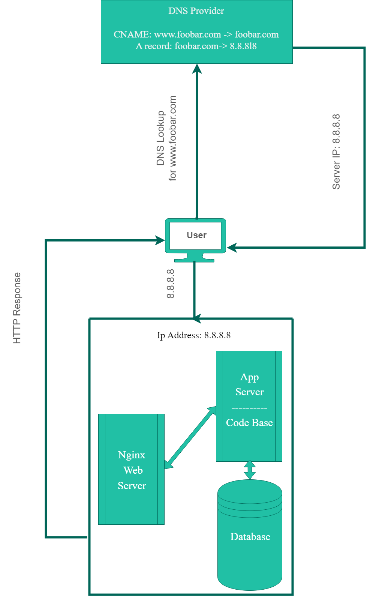

# [Infrastructure Diagram](https://imgur.com/a/oe435zc)



## Definitions

- What's a `Server`?

```text
    A server is a hardware, software, or virtual device that provides services for other
    devices called 'clients', in a client-server model.
```

- What's the role of the `Domain Name`?

```text
    A domain name is used to convert server's IP addresses into human readable text
    that's easier to remember, and this whole process is done via a DNS server that
    performs this translation internally.
```

- What type of `DNS` record `www` is in `www.foobar.com`?

```text
    'www' represents a CNAME record for foobar.com
```

- What the role of the `Web Server`?

```text
    A web server can be hardware that stores web server software and website's components,
    a software that accepts and responds to HTTP requests,
    or both of them together.
```

- What the role of the `Application Server`?

```text
    Application server hosts applications, or stores business-side logic
    and provides it via a communication protocol, usually HTTP.
```

- What the role of the `Database`?

```text
    Database is a type of data storage, that consists of an organized collection
    of information structured into rows and columns, for easier access, management, and updating.
```

- What's the server using to communicate with the computer of the user requesting the website?

```text
    The server uses HTTP or HTTPS to communicate with client computers.
```

---

## Issues

- SPOF (single-point-of-failure)

```text
    This server infrastructure is highly vulnerable to the risk of failure,
    due to having only one primary server that contains all the needed services.

    It also has only one Database (MySQL) server, one codebase, one web server,
    each and every one of these represents a single-point-of-failure, that is whenever
    an unwanted or unexpected failure happens to anyone of them the whole server fails.
```

- Maintenance Downtime

```text
    Due to having only one server, whenever it's maintenance time, the whole server
    has to go down until maintenance is over in order to get back up again.

    So the website will be in having a big downtime issue.
```

- Scaling to larger traffic

```text
    Due to having only one server, we cannot implement load balancing to incoming requests,
    which will result in that server to run out of resources or slow down when
    receiving a large number of requests.
```
