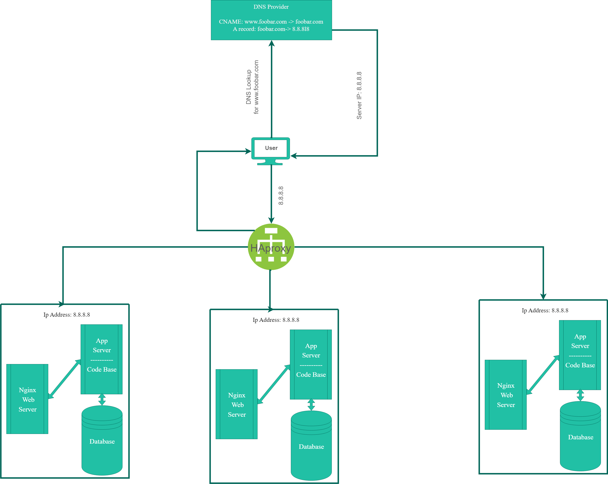

# Distributed Infrastructure



---

## Definitions

- The newly added Server and its components

```text
    The second server is to add redundancy to the infrastructure, which in turn resolves
    the problem of resources overloading.

    Because when we have 2 servers, we can implement load balancing between them,
    which distributes the work equally over both of them.
```

- The Load Balancer `HAproxy` Added

```text
    The Load Balancer is to help distribute requests equally over available resources,
    which helps in scaling the infrastructure to process more requests when needed.
```

- The distribution algorithm `load balancer` is configured with

```text
    HAProxy Load Balancer implements the Round Robin algorithm.

    It serves requests by the servers sequentially one after the other,
    and one the last request is served by the last server, it goes back and start over again.

    This algorithm is best used when we have servers of equal specifications,
    and there isn't much persistent connections.
```

- Is Load Balancer enabling active/active or active/passive setup?

```text
    In HAProxy both setups are available,
    and the choice of one over the other depends on the target of the deployment.

    If the goal is high availability and having a fallback mechanism, then Active/Passive setup
    is preferred.

    If the goal is Load distribution and high response time, as well as high availability,
    then Active/Active setup is preferred.

    In Active/Passive setup one HAProxy instance is processing incoming requests, while the other
    is on standby state, in case Active instance fails the passive one takes over.

    In Active/Active setup multiple instance are active at the same time
    and share incoming traffic.
```

- How database `Primary-Replica`(Master-Slave) cluster works?

```text
    This database setup is used to ensure High-availability, backup,
    and reduce maintenance downtime.

    Also it can be used to distribute read load off the primary database.

    Typically, primary database records all its transactions and updates in a log.

    The replica connects to the primary and reapply all the transactions and operations
    in that log on its own data, this process is called replication.

    Now whenever the primary database fails or go in downtime, the replica can take over.
```

- difference between the Primary node and the Replica node in the application

```text
    The primary node is responsible for all the write operations along with the read operations.

    The replica is known to be read-only and helps offload the primary with read operations,
    which highly improves performance,
    but it can be configured to allow write operations if needed.
```

---

# Issues with Infrastructure

- SPOF

```text
    Having only one Load Balancer represents a SPOF, since any failure that happens to it would cause
    the incoming traffic to not be distributed.
```

- No `Firewalls`, No `SSL certificates`

```text
    Having no firewall makes limiting and managing incoming traffic impossible,
    which can let to attackers to perform DDoS attacks, or port scanning to exploit open ports.

    Having no SSL certificate and communicating over HTTP is very dangerous,
    since HTTP transfers plain text, any attacker can view sensitive information such as passwords,
    or credit card information.
```

- No Monitoring

```text
    Since there are no monitoring software, Server performance cannot be measured.

    Hence, if it's experiencing any performance issues, downtime, or security threats
    they won't get fixed, because they can't be noticed in the first place.
```
