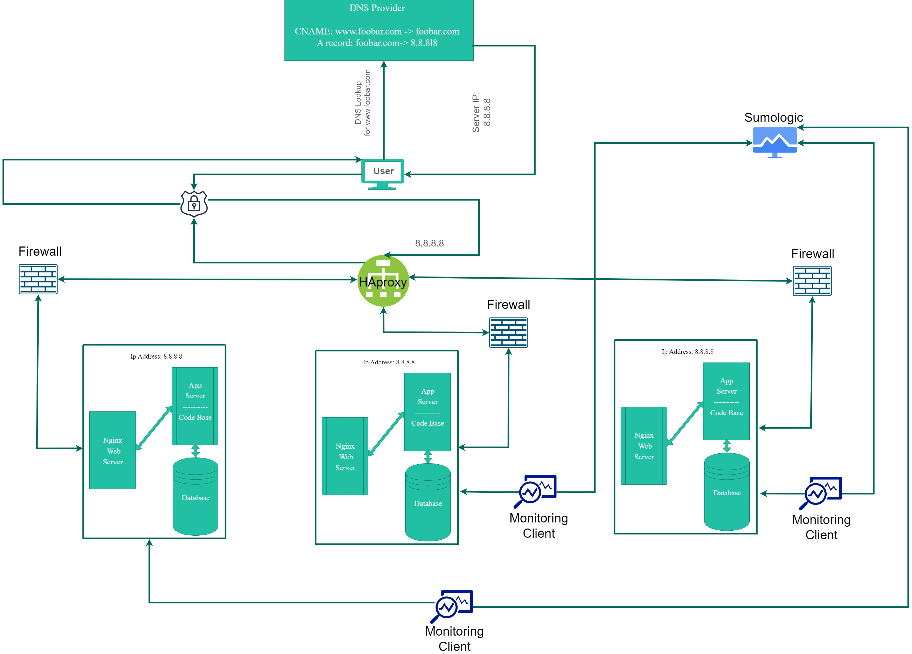

# [Distributed Infrastructure](https://imgur.com/a/uF8CQlJ)



---

## Definitions

- `Firewalls`

```text
    Firewalls are a security tool that's added to manage and monitor
    incoming and outgoing traffic.

    it helps in allowing, rejecting, or limiting traffic as needed.

    which can help eliminate the risk of DDoS attacks on the server,
    and unauthorized access.
```

- `SSL Certificates`

```text
    SSL certificates is issued when a client requests and HTTPS connection,
    the server will send its SSL certificate to the client, which contains
    the needed public key to initiate the connection.

    when this process is completed successfully, an HTTPS connection is established,
    and client will see a padlock icon in the browser.
```

- Why is traffic served over `HTTPS`

```text
    because HTTP is dangerous, it transfers data in plain text format,
    which makes it easy to any attacker who can get in the middle of the connection
    between the server and the client, to read the exchanged information,
    even if it contains sensitive data.

    HTTPS works on encrypting information while it's being transferred between
    the client and the server, using asymmetric encryption with public and private keys.

    Now even if an attacker is in the middle of the connection, he can't get any
    information out of the encrypted data, unless he has the private key.
```

- `Monitoring`

```text
    Monitoring is used in evaluating server's performance, downtime, response time, ...etc.

    this helps in making sure that everything is going as expected,
    as well as alerting any unusual occurrence and fix it as soon as possible
    before it causes a bigger problem.
```

- How `monitoring` tools collect data?

```text
    Some monitoring tools use clients/agents installed on the server,
    those clients collect data about the server and send it back to the monitoring
    system to be analyzed.

    Other tools analyze existing log files, as most systems, application, and devices
    generate log files that provide data about errors, events, and other information.

    There are many other ways as well depending on the monitoring system used.
```

- How to monitor a web server `QPS`?

```text
    I would ensure that my web server stores data about incoming requests in a log file,
    then I can use a monitoring tool that can analyze log files to extract an average
    number of queries performed by the server each second.
```

---

# Issues with this infrastructure

- Why terminating `SSL` at the `Load Balancer` is dangerous?

```text
    Terminating SSL in the Load Balancer can cause some security risks,
    because then the traffic between the load balancer and backend servers
    will often be unencrypted, and this can lead to the same attacks that can happen
    in case of HTTP connection.
```

- Why having only one MySQL server capable of accepting writes is an issue?

```text
    because if an error happens to that server or for some reason it goes down,
    it won't be possible to add or update data in the server,
    and some features of the application won't work.

    This is known as a Single-point-of-failure or SPOF.
```

- Why having servers with all the same components(database, web server and application server) might be a problem?

```text
    Because, here as well, this lead to having a SPOF, if one server goes down,
    all the rest follow.

    If data in one component gets corrupted or a bug happens in one codebase,
    it will affect all the other components in other servers.

    This can also cause resources overloading as all servers will
    compete over the same resources.
```
